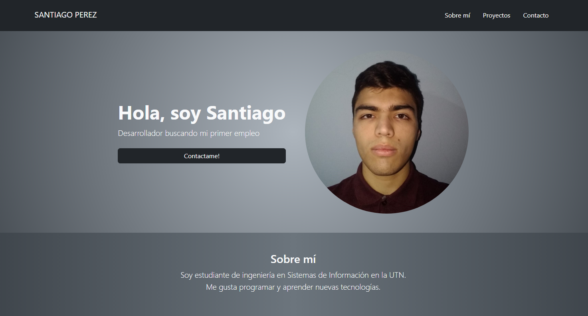

# Portfolio de Santiago Perez

Este es mi portfolio personal, donde presento mis habilidades técnicas, información sobre mí y mi experiencia como desarrollador. Está construido con HTML, CSS, JavaScript y Bootstrap.

Aclaracion: Todavía no está terminado, faltan armar algunas cosas y agregar información, pero quise ir subiendo lo que hice hasta ahora!

## 🚀 Tecnologías utilizadas

- HTML5
- CSS3
- JavaScript (vanilla)
- Bootstrap 5
- Formspree

## ✨ Funcionalidades

- Diseño responsive
- Animaciones y estilos modernos
- Formulario de contacto (Formspree para enviarlo a mi correo y js para evitar la redirección y manejarlo a gusto)

## 📸 Captura

 <!-- Si tenés una imagen del sitio -->

## 📫 Contacto

Podés contactarme a través de:
- El formulario del portfolio
- santi.agus.perez.2002@gmail.com
- linkedin.com/in/santiago-agustín-perez-b83346244/

## 🔗 Deployment

Este sitio está publicado en:  
➡️ https://santyperezzz.github.io/portfolio_bootstrap/
